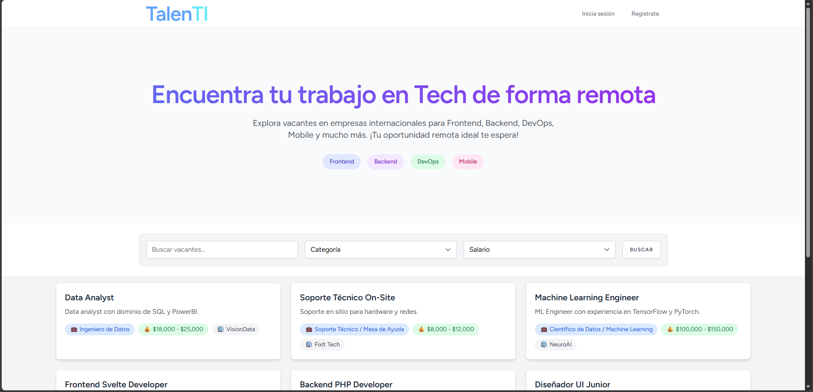

# TalenTI – Guía de Instalación y Configuración



## Requisitos previos

Antes de comenzar, asegúrate de tener instalados los siguientes componentes:

1. [Git](https://git-scm.com/): Necesario para clonar el repositorio.
2. [PHP](https://www.php.net/): Laravel requiere PHP y algunas extensiones habilitadas.
3. [Composer](https://getcomposer.org/): Gestor de dependencias de PHP.
4. [Node.js](https://nodejs.org/es): Requerido para compilar assets del frontend.
5. Cuenta de [Mailtrap](https://mailtrap.io/): Usada para pruebas de envío de correos.

### Base de datos (MySQL o cualquier motor compatible)

El backend requiere una **base de datos**, pero no es obligatorio usar MySQL específicamente.

Laravel es compatible con varios sistemas de gestión de bases de datos, por lo que puedes usar el que prefieras.

Motores soportados por Laravel:

- MySQL / MariaDB (recomendado)
- PostgreSQL
- SQLite
- SQL Server

Solo debes asegurarte de:

1. Tener el motor de base de datos instalado.
2. Crear una base de datos para el proyecto.
3. Configurar correctamente el archivo .env.

## 1. Clonar el repositorio

```bash
git clone https://github.com/Jos3-Lu1s/TalenTI.git
cd TalenTI
```

## 2. Instalar las dependencias del backend (Laravel)

### Instalar Composer

Si no lo tienes, puedes descargarlo [aqui](https://getcomposer.org/).

### Instalar dependencias de PHP y node

```bash
composer install
```

```bash
npm install
```

## 3. Configurar el archivo `.env`

Si el proyecto no incluye el archivo `.env`, crea uno a partir del ejemplo:

```bash
cp .env.example .env
```

Genera la clave de aplicación:

```bash
php artisan key:generate
```

## 4. Configurar la base de datos

> Crea la base de datos.

Asegúrate de configurar los parámetros correctos en el archivo `.env`:

Por ejemplo, si usas MySQL, necesitarás algo como:

```ini
DB_CONNECTION=mysql
DB_HOST=127.0.0.1
DB_PORT=3306
DB_DATABASE=nombre_de_base_de_datos
DB_USERNAME=tu_usuario
DB_PASSWORD=tu_contraseña
```

Ejemplo para PostgreSQL:

```ini
DB_CONNECTION=pgsql
DB_HOST=127.0.0.1
DB_PORT=5432
DB_DATABASE=talenti
DB_USERNAME=postgres
DB_PASSWORD=1234
```

> Asegúrate de haber creado la base de datos antes de continuar.

Ejecuta las migraciones:

```bash
php artisan migrate
```

Ejecuta los seeders:

```bash
php artisan db:seed
```

## 5. Configurar servicio de correo (Mailtrap)

Mailtrap permite recibir y visualizar correos sin enviarlos realmente, ideal para entornos locales.

1. Crea una cuenta en: [Mailtrap](https://mailtrap.io/)
2. Crea una inbox (bandeja) dentro de Mailtrap.
3. Copia las credenciales SMTP que te da Mailtrap y pégalas en tu archivo `.env`:

```ini
MAIL_MAILER=smtp
MAIL_HOST=sandbox.smtp.mailtrap.io
MAIL_PORT=2525
MAIL_USERNAME=tu_usuario_mailtrap
MAIL_PASSWORD=tu_contraseña_mailtrap
MAIL_ENCRYPTION=tls
MAIL_FROM_ADDRESS="no-reply@talenti.com"
MAIL_FROM_NAME="TalenTI"
```

## 6. Almacenamiento de documentos

El proyecto utiliza almacenamiento público mediante un enlace simbólico. Ejecuta:

```bash
php artisan storage:link
```

Este comando crea un enlace simbólico llamado `public/storage` que apunta a `storage/app/public`, permitiendo que los archivos se sirvan correctamente.

## 7. Servir el proyecto

### Servir el frontend

```bash
npm run dev
```

Disponible en: [http://localhost:3000](http://localhost:3000)

### Servir el backend

```bash
php artisan serve
```

Disponible en: [http://localhost:8000](http://localhost:8000)

## Acceder a la aplicación

Backend (Laravel): [http://localhost:8000](http://localhost:8000)

Frontend (React): [http://localhost:3000](http://localhost:3000)

Si todo está bien configurado, deberías ver tu aplicación funcionando.
